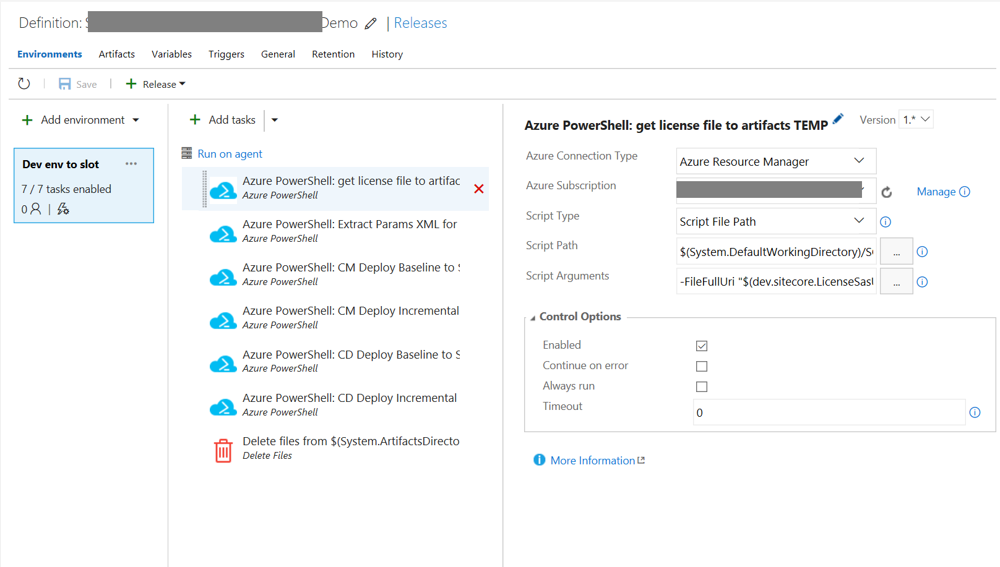

# Sitecore XM 8.2u5 - DevOps with VSTS guide

_Disclaimer: This Sample Code is provided for the purpose of illustration only and is not intended to be used in a production environment._ 

This document provides a step-by-step guide to leveraging Visual Studio Team Services to setup a continuous build and release pipeline based on Sitecore 8.2u5. It does not include a full pipeline that you would have in a real world case, but a good starting point.

Authors: Christof Claessens and Katrien De Graeve - code samples and guide provided for learning purposes, without any warranties

### Pre-requisites

- Create a connection (Service Endpoint) to Azure. This will create a Service Principal in your Azure subscription. This is the account that will be running Azure ARM/API commands to create, update and delete Azure resources. See how in [this post from Donovon Brown](http://www.donovanbrown.com/post/Creating-an-Azure-Resource-Manager-Service-Endpoint).
- The source packages from Sitecore. We chose to add these to Git repo in our case. You could also decide to add these to a Storage account and point to them. 

## Build pipeline

#### Part 1 - Store artifacts for provisioning Azure resources
This build pipeline copies all PS1 and ARM templates from this sample repo (the current directory and children) to a VSTS Artifacts drop location. We need to do this as we want to leverage PowerShell scripts and the ARM Json templates in our Release pipeline, which we need to have available as artifacts in order to use them.

* Step 1 - Create a new Build definition linked to your repo with all JSON templates and PS1 (this repo). Choose a Hosted agent in your build process.
* Step 2 - Add 'Get Sources' task. Choose the project where your ARM and PS files are stored, and choose the correct branch.
* Step 3 - Add 'Copy Files' task. Take source folder 'sitecore-oob/Sitecore 8.2.3', filter on the contents you want in the artifacts.   
  In our case the filter for the Contents is as follows:  

```
  packages/xM1/*  
  templates/**  
  vsts/*  
  *.ps1  
```
  Target folder: $(Build.ArtifactStagingDirectory)

* Step 4 - Add 'Publish Artifacts' Task. Publish into the '$(Build.ArtifactStagingDirectory)' destination and give your artifacts a name (you'll need this in your Release pipeline). In our case 'baseprovisioning' is the artifact name.  


#### Part 2 - Build the custom Sitecore project (incremental)
To build the custom project, our build pipeline leverages a custom VSTS Task. Please see `/sitecore-vsts-tasks/README.MD` file in order to install the Task on your VSTS account.
This custom VSTS task leverages a set of gulp scripts like Habitat does: building every project, overlaying the files into a single location and packaging the result in a web deploy package.
* Step 1 - Install the pre-requisite VSTS task: Please see `/sitecore-vsts-tasks/README.MD`
* Step 2 - Copy the needed files into your Helix solution from:
`/helix solution/`
* Step 3 - Create a new build pipeline in VSTS, based on the repo with your custom code (this one will get incrementally deployed).
* Step 4 - Add VSTS task 'Get sources' from your custom Sitecore solution. Select the right project, repo and branch.
* Step 5 - Add VSTS Task 'NuGet restore'.  

* Step 6 - Add VSTS Task `npm install gulp-cli`.
  * Parameter Command: `custom`
  * Parameter Command and arguments: `install gulp-cli -g`

* Step 7 - Add VSTS Task `npm install`.
  * Parameter Command: `install`

* Step 8 - Add VSTS Task `gulp CI-And-Prepare-Files-CM-CD`.
  * Gulp File Path: `gulpfile-ci.js`
  * Gulp Task(s): `CI-And-Prepare-Files-CM-CD`
  * (See https://visionsincode.wordpress.com/2017/08/31/continuous-integration-and-deployment-of-sitecore-habitathelix-as-an-azure-web-app/ for more details)

* Step 9 - Add VSTS custom task VstsSitecoreSingleWebDeploy (the one installed to VSTS in step 1) for CM role
  * Source Website Path: leave default value
  * Web deploy package name: rename to `webdeploy_CM.zip`
  * Parameter Temp path: by default '$(Agent.BuildDirectory)\Temp'
  * Parameter Packages Output Dir: $(Build.ArtifactStagingDirectory)
  * Parameter Name for resulting Build Artifact: typically output or another name you choose  
  
* Step 10 - Add VSTS custom task VstsSitecoreSingleWebDeploy (the one installed to VSTS in step 1) for CD role
  * Source Website Path: change to `$(Agent.BuildDirectory)\s\Deploy\WebsiteCD`
  * Web deploy package name: rename to `webdeploy_CD.zip`
  * Parameter Temp path: by default '$(Agent.BuildDirectory)\Temp'
  * Parameter Packages Output Dir: $(Build.ArtifactStagingDirectory)
  * Parameter Name for resulting Build Artifact: typically output or another name you choose  
  
* Make sure to schedule a build and verify the resulting artifact that was published is indeed a webdeploy.zip package.

## Release pipeline

#### Variables group for use within one environment's release
We chose to store variables in a group that can be reused across two different pipelines. You can always overwrite the variables in the Release pipeline's Environment variables.  
Go to Build & Release > Library > Variable group. Here's an example of our variables. For the license file you might want to look into [Secure files](https://www.visualstudio.com/en-us/docs/build/concepts/library/secure-files) which we don't here in this example.

 

Note the Service Principal variable, which holds the ObjectID of the VSTS Service principal account that executes the Azure commands. You need to retrieve this ObjectId as follows:

1. In VSTS, go to the Service Endpoint of your Azure connection. Click 'Manage Service Principal'. This will open the classic Azure Portal. Copy the name of the app (something like visualstudiospn[guid]). We'll move to the new Azure portal to complete the steps.
2. Log into the Azure Portal, go to Active Directory, click App registrations, and search by name. You should get one app with the above name.
3. Click the App name, this opens the app's blade. From here we actually want the Service Principal associated to the app. Click the link in the Overview pane 'Managed application in local directory'. This opens up the Service Principal.
4. Click Properties and take note of the ObjectId for the Service principal. You'll need it in above discussed variables.  
 

#### Part 1 - Once per environment: Base provisioning of Azure resources and Sitecore baseline CM and CD

* Step 1 - Create a new Release definition, based on the first Build definition from part 1 (this is the build that copies ARM and Powershell scripts to the artifacts folder).
* Step 2 - Create a Variables group that you'll need to pass on to the arguments in the tasks. Link this group in the Artifacts pane. See above also.
* Step 3 - Add 'Azure PowerShell' Task. Select the PS 'vsts/downloadUrl.ps1' via the selector. Add the arguments as needed, leveraging the variables to pass on their values.  

Note: for the Azure Powershell task you need to select your Subscription and create a service principal if not yet done so. Do this through the Manage button in the task.  
Parameter sample in our case: 

```
-FileFullUri "$(dev.sitecore.LicenseSasUri)" -TempFolderName "$(System.ArtifactsDirectory)\MYBUILDNAME\baseprovisioning\$(general.LocalTempFolder)" -FileName "$(dev.sitecore.LicenseFileName)"
```

* Step 4 - Add 'Azure PowerShell' Task. Link to the PS 'deploy-xm1-initial.ps1'. Example our parameters:   

```
-SubscriptionName "$(dev.azure.SubscriptionName)" -RGName "$(dev.azure.ResourceGroupName)" -Location "$(dev.azure.ResourceGroupLocation)" -ResourcePrefix "$(dev.azure.ResourcePrefix)" -SitecorePwd "$(dev.azure.SitecorePwd)" -SqlServerLogin $(dev.azure.SqlServerLogin) -SqlServerPwd "$(dev.azure.SqlServerPwd)" -StorageAccountNameDeploy "$(dev.azure.StorageAccountNameDeploy)" -PathToSitecoreLicenseFile "$(System.ArtifactsDirectory)\MYBUILDNAME\baseprovisioning\$(general.LocalTempFolder)\$(dev.sitecore.LicenseFileName)" -ArtifactsRootDir "$(System.ArtifactsDirectory)\MYBUILDNAME\baseprovisioning" -KeyVaultAdminMailAddressOrObjectId "$(dev.azure.ServicePrincipalObjectId)"    
```

Note this script requires a lot of arguments that you'll use from your variable set. 
* Step 5 - Add 'Delete Files' task. Refer to the temp directory where the license file (in step 3) was saved to. You'll want to clean this directory on the agent using this task. Again Secure Files might be a something to look at here.


#### Part 2 - Incremental deploy of custom project(s) 

This Release pipeline will be run every time you are publishing a new version of custom code and Unicorn/serialized content to Sitecore. This guide is very simple and only addresses a single 'dev' environment continuous deployment. Optimally you'd extend this with multiple environments, approvers, extra steps to automate Unicorn, Site swaps, database backups and more. 

* Step 1 - Create a new Release definition.
* Step 2 - Link both the Build artifacts from above (both the custom code project, and the templates/PS file). This is done through the Artifacts link in the Release definition edit screen.
* Step 3 - Link the variables collection used in the previous release.
* Step 4 - Add VSTS Task 'Azure PowerShell' to run 'vsts/downloadUrl.ps1'. This will download the license.xml file from a Sas blob URI onto a temp folder.
* Step 5 - Add VSTS Task 'Azure PowerShell' to run 'extract-params.ps1'. This will create temporary XML parameter files. Here's an example of what we used for the script's arguments:  

```
-SubscriptionName "$(dev.azure.SubscriptionName)" -RGName "$(dev.azure.ResourceGroupName)" -Location "$(dev.azure.ResourceGroupLocation)" -PathToSitecoreLicenseFile "$(System.ArtifactsDirectory)\MYBUILD1\baseprovisioning\$(general.LocalTempFolder)\$(dev.sitecore.LicenseFileName)" -ArtifactsRootDir "$(System.ArtifactsDirectory)\MYBUILD1\baseprovisioning" -TempFolderName "$(System.ArtifactsDirectory)\MYBUILD1\baseprovisioning\$(general.LocalTempFolder)" -SetParamsCmOutputFilePath "$(System.ArtifactsDirectory)\MYBUILD1\baseprovisioning\$(general.LocalTempFolder)\$(dev.sitecore.CmParamFilename)" -SetParamsCdOutputFilePath "$(System.ArtifactsDirectory)\MYBUILD1\baseprovisioning\$(general.LocalTempFolder)\$(dev.sitecore.CdParamFilename)"
```

* Step 5.1 (OPTIONAL) - Add VSTS Task 'Azure PowerShell' to run 'recreate-slots-xm.ps1'. This will create staging slots for CM & CD roles right before the actual MSDeploy tasks. Here's an example of what we used for the script's arguments:

```
-SubscriptionName "$(dev.azure.SubscriptionName)" -RGName "$(dev.azure.ResourceGroupName)"
```


* Step 6 - CM Baseline re-deploy -  Add VSTS Task 'Azure PowerShell' to run 'deploy-xm1-continuous.ps1'. We will repeat this step 4 times (CM baseline, CM incremental, CD baseline, CD incremental). The parameters are similar except for passing on CD/CM packages, and the use of the -Role, -SkipDbOperations and -DoNotDeleteExistingFiles. Showing the full list for the first task here, then only the main differences for the next 3:  

```
-SubscriptionName "$(dev.azure.SubscriptionName)" -RGName "$(dev.azure.ResourceGroupName)" -PackageLocation "$(System.DefaultWorkingDirectory)\MYBUILD1/baseprovisioning\packages\xM1\Sitecore 8.2 rev. 170407_cm.scwdp.zip" -ParamsFileLocation "$(System.ArtifactsDirectory)\MYBUILD1\baseprovisioning\$(general.LocalTempFolder)\$(dev.sitecore.CmParamFilename)" -ArtifactsRootDir "$(System.ArtifactsDirectory)\MYBUILD1\baseprovisioning" -TempFolderName "$(System.ArtifactsDirectory)\MYBUILD1\baseprovisioning\$(general.LocalTempFolder)" -Role "CM" -SkipDbOperations
```

* Step 7 - CM Incremental deploy -  Add VSTS Task Azure PowerShell to run 'deploy-xm1-continuous.ps1'.
  * Important for the arguments to pass these:  `-PackageLocation "$(System.ArtifactsDirectory)\MYBUILD2\SitecoreWebDeployPackage\webdeploy_CM.zip" -Role "CM" -DoNotDeleteExistingFiles` (and others that are required).
* Step 8 - CD Baseline re-deploy -  Add VSTS Task Azure Powershell to run 'deploy-xm1-continuous.ps1'.
  * Important for the arguments to pass these:  `-Role "CD" -SkipDbOperations` (and others that are required).
* Step 9 - CD Incremental deploy -  Add VSTS Task Azure Powershell to run 'deploy-xm1-continuous.ps1'.
  * Important for the arguments to pass these:  `-PackageLocation "$(System.ArtifactsDirectory)\MYBUILD2\SitecoreWebDeployPackage\webdeploy_CD.zip" -Role "CD" -DoNotDeleteExistingFiles` (and others that are required).
* Step 10 - Add VSTS Task Delete Files and refer to the temp directory to be cleaned.  
For the dev Environment you should have a set of tasks like this:   


Next steps are to add environments, add steps in between the dev environment to backup database, swap slots and more. Hopefully this guide was useful to kickstart your devops process for Sitecore 8.2u5 on Azure PaaS.
